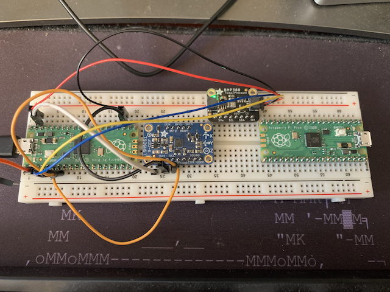

# pico_data_log
This is a logger im setting up to log telemtry data from model rocket flights with

You can run the logger then view data with the pandas script:

I'm running a pico with a LSM9DS1 9-DOF and a BMP388 temp+pressure from adafruit

# TODO
1. enable logging to a file
2. clean up sensor data to make it easier to choose which sensor to read and which sensor to log
3. clean up logger multi dimensional madness
